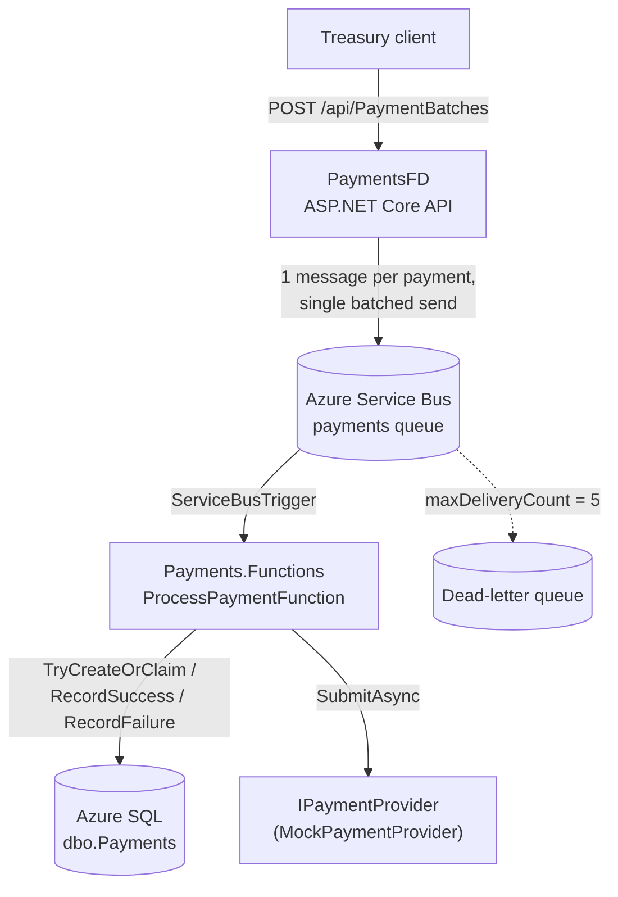
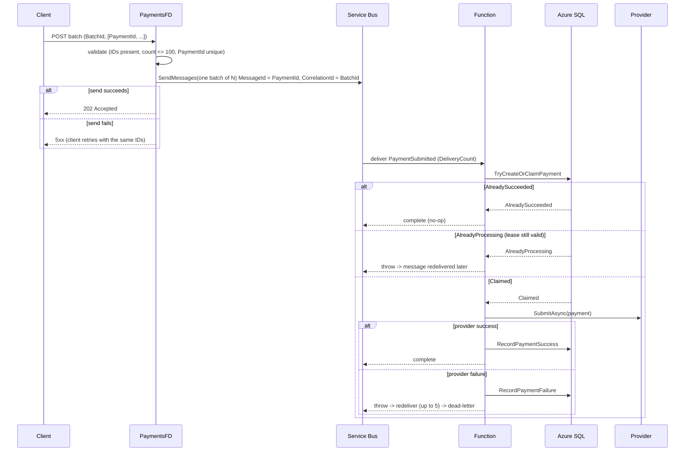
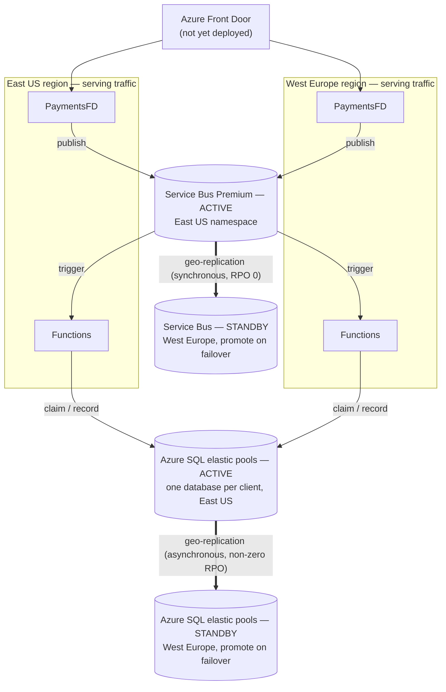

# RTPayments — System Design

---

## 1. Problem and scope

### 1.1 The problem

Corporate treasury teams dispatch large numbers of outbound payments each business day — vendor
disbursements, inter-company transfers, loan repayments — across multiple banking partners and
currencies. Today this is manual, fragile, and error-prone. The team needs the core of a service
that accepts a batch of payment instructions and processes each one reliably, with the
correctness, auditability, and precision that financial operations require.

### 1.2 Explicit scope decisions

| Decision | Rationale | Where it would change |
|---|---|---|
| Batches are not all-or-nothing | Each payment succeeds or fails independently; a batch can finish partly succeeded, and the client reconciles from the per-payment outcomes | All-or-nothing settlement would need a validation/reservation phase before any payment executes, plus a batch aggregate to hold the decision |
| ≤ 100 payments per request | Keeps a request within one Service Bus message batch and one send, so a request is never partially published | Deliberate server-side splitting with its own coordination |
| Client-generated `BatchId` and `PaymentId` | Lets the client retry ambiguous outcomes with stable identifiers; no dedupe table needed in the API | Per-account ID namespacing if cross-tenant collisions become a concern |
| At-least-once processing with durable idempotency | Exactly-once across a broker, a database, and an external provider is not achievable without provider cooperation | Provider idempotency keys + a reconciliation ledger (see §5.5, §7) |

---

## 2. Architecture

### 2.1 Components



| Project | Responsibility |
|---|---|
| `PaymentsFD` | Validate and accept batches; publish one message per payment; return `202 Accepted` |
| `Payments.ServiceBus` | Shared message contract (`PaymentSubmittedMessage`) and the Service Bus publisher |
| `Payments.Functions` | Queue-triggered worker: claim, call provider, record outcome |
| `Payments.Database` | Schema and stored procedures for payment state and the atomic claim |
| `Payments.Deploy` | Bicep templates for the two-region Azure deployment |

`Payments.Database` and `Payments.Deploy` are not MSBuild projects and are not in `RTPayments.slnx`.

### 2.2 Request flow



### 2.3 Why Service Bus is the ingestion boundary

An alternative was considered where `PaymentsFD` writes every payment directly to SQL and a
change feed drives downstream processing. That makes SQL the ingestion point, but a large batch
becomes a burst of database writes at request time, and many concurrent submissions concentrate
both ingestion and processing-state traffic on SQL before the system can smooth it.

Publishing payment work to Service Bus first lets the queue absorb bursts and lets the worker
apply SQL writes at a controlled processing rate, protecting the database from a batch-sized
write spike.

**Tradeoffs accepted:**

- Payment state is not visible in SQL until the worker consumes the message. There is a window
  between `202 Accepted` and the first `dbo.Payments` row.
- Service Bus becomes a first-class availability and operational dependency.

### 2.4 Key decisions and tradeoffs

| Decision | Alternative | Why this choice | Cost |
|---|---|---|---|
| Queue-first ingestion | SQL-first + change feed | Burst absorption; protects the database | State invisible until consumed; SB is critical-path |
| Single batched send, reject if it doesn't fit | Split across multiple sends | A request is never partially published | Oversized requests are rejected, not split |
| One message per payment | One message per batch | Independent retry, DLQ, and scaling per payment | N messages instead of 1; batch send must fit one frame |
| No batch entity in SQL | A `Batches` table with its own status and lifecycle | A batch is a submission grouping, not a lifecycle object at this scope; `BatchId` on each payment row plus an index covers status and reporting | Maker-checker approval, batch-level limits, or all-or-nothing settlement would later require a batch aggregate |
| Azure Functions (Service Bus trigger, isolated worker) | Worker Service / Container Apps | Scale-to-zero, native trigger binding, least infrastructure | Cold starts on Consumption; execution limits; local-dev friction |
| Client-generated IDs | Server-generated IDs + dedupe table | End-to-end idempotency for ambiguous retries with no extra state in the API | Trusts the client for uniqueness (PK still enforces) |

---

## 3. API design

### 3.1 Contract

`POST /api/PaymentBatches`

```json
{
  "batchId": "11111111-1111-1111-1111-111111111111",
  "treasuryAccountId": "treasury-001",
  "settlementDate": "2026-08-31",
  "payments": [
    {
      "paymentId": "22222222-2222-2222-2222-222222222222",
      "beneficiaryName": "Example Beneficiary",
      "beneficiaryAccount": "account-001",
      "currency": "USD",
      "amount": 125.50,
      "description": "Example payment"
    }
  ]
}
```

Response `202 Accepted`:

```json
{ "batchId": "1111...", "status": "Accepted", "submittedAtUtc": "2026-09-02T12:00:00Z" }
```

### 3.2 Validation (_current state_)

Performed in `PaymentBatchesController` before any publish:

- `BatchId` present (non-empty GUID)
- `TreasuryAccountId` present
- At least one payment, at most 100
- Every `PaymentId` present
- `PaymentId` values unique within the batch

**Not yet validated** (see §5.4 and §7): currency against ISO 4217, amount scale/precision,
`settlementDate` format and business-day rules, beneficiary field presence. `description` is
accepted by the contract but not propagated to the message or the database.

### 3.3 Status codes and client retry semantics

| Response | Meaning | Client action |
|---|---|---|
| `202 Accepted` | All messages were published | None; poll for status (endpoint is future work — see §7) |
| `400 Bad Request` | Validation failure; nothing was published | Fix the request; do not retry as-is |
| `5xx` / timeout / connection failure | Ambiguous — the publish may or may not have succeeded | Retry with the **same** `BatchId` and `PaymentId` values |

Reusing identifiers on retry is what lets Service Bus duplicate detection and the SQL claim
recognise the retry as the same logical work. Generating new identifiers would create new
payments.

### 3.4 Why client-generated identifiers

The client is the only party that can safely retry an ambiguous outcome. If the API generated
identifiers, a retried request would produce a second set of payments, and the API would need its
own deduplication store keyed on some client-supplied token — which is just a client-generated
identifier by another name. Making the identifier explicit in the contract moves the
responsibility to where it belongs and keeps the API stateless.

---

## 4. Data model and storage strategy

### 4.1 Storage topology — one database per client

Each corporate client (`TreasuryAccountId`) gets its own Azure SQL database running the schema and
stored procedures below. Databases are grouped into **elastic pools** so they share compute —
payment traffic is bursty and idle between rail cut-offs, so a pool sized for the aggregate is far
cheaper than a database sized for each client's peak. A small **catalog** maps `TreasuryAccountId`
to its database (logical server + pool + connection string); the API and the workers resolve and
cache that mapping per request.

Why this shape:

- **Isolation.** One client's month-end surge is bounded by the pool's per-database cap, and it
  cannot take locks on another client's data because there is no shared table.
- **Blast radius.** A bad migration, a hot index, or a poison data pattern is contained to one
  client's database.
- **Per-client operations.** Point-in-time restore, export, and hard-delete (offboarding,
  data-protection requests) are single-database operations; a client's database can be pinned to a
  region for data residency.
- **Contention all but disappears.** `TryCreateOrClaimPayment` (§5.1) runs against a table holding
  one client's payments — hundreds of in-flight rows, not millions — so the `HOLDLOCK` key-range
  lock and the `Status` index stop being global hotspots.

What it costs:

- A **catalog / routing** component that must be highly available and sits on the hot path (cache
  aggressively; it is read-mostly and changes only on onboarding).
- **Schema migrations fan out** across every client database — an orchestrated, resumable,
  monitored rollout (Azure **Elastic Database Jobs** or an equivalent runner), not a single
  `ALTER`.

### 4.2 Schema

`dbo.Payments` — one per client database (see [`Payments.Database/Schema/Payments.sql`](../Payments.Database/Schema/Payments.sql)):

| Column | Type | Notes |
|---|---|---|
| `PaymentId` | `uniqueidentifier` | Primary key; client-supplied; the idempotency anchor |
| `BatchId` | `uniqueidentifier` | Submission grouping; non-clustered index |
| `TreasuryAccountId` | `nvarchar(100)` | Owning account; identical for every row in a per-client database — kept for portability to the archive/analytics store |
| `BeneficiaryName` / `BeneficiaryAccount` | `nvarchar(200)` | Destination |
| `Currency` | `char(3)` | ISO 4217 code (not yet validated on write) |
| `Amount` | `decimal(19,4)` | `CHECK (Amount > 0)`; fixed-point, never floating point |
| `SettlementDate` | `date` | Requested settlement date (informational at this scope) |
| `Status` | `nvarchar(30)` | `CHECK IN ('Pending','Processing','Succeeded','Failed')` |
| `AttemptCount` | `int` | Incremented on each claim |
| `ProcessingStartedAtUtc` | `datetime2(7)` | Lease start; `NULL` when not being processed |
| `ProcessedAtUtc` | `datetime2(7)` | Terminal timestamp |
| `FailureReason` | `nvarchar(1000)` | Last failure detail |

Indexes: `IX_Payments_BatchId` (batch status queries), `IX_Payments_Status` (operational sweeps).
Both stay small because a database holds one client's payments.

### 4.3 No batch table

Batch status is a projection over payment rows:

```sql
SELECT [Status], COUNT(*) AS [Count]
FROM   [dbo].[Payments]
WHERE  [BatchId] = @BatchId
GROUP  BY [Status];
```

A batch has no independent lifecycle at this scope, so there is nothing for a batch row to own
beyond what this query derives. A batch aggregate would be introduced when a batch gains
behaviour of its own: maker-checker approval, batch-level limits or fees, all-or-nothing
settlement, or a completion webhook (which needs a record to hang the "completed" event on).

### 4.4 Auditability (_current state_ and _production_)

_Current state:_ each payment row carries its current `Status`, `AttemptCount`, the lease and
terminal timestamps, and the last `FailureReason`. This is a point-in-time view, not a history.

_Production:_ financial operations require an immutable trail. The next step is an append-only
`dbo.PaymentEvents` table — one row per transition (`PaymentAccepted`, `PaymentClaimed`,
`ProviderCalled`, `ProviderSucceeded`, `ProviderFailed`, `DeadLettered`) with timestamp, actor,
attempt number, and correlation id — written in the same transaction as the state change. Events
are never updated or deleted, have a defined retention period, and can be exported for auditors.

### 4.5 Data-layer abstraction

`IPaymentStore` (in `Payments.Functions/Data`) is the seam the brief asks for. `SqlPaymentStore`
is the only implementation. Honest assessment: the _interface_ is swappable, but the
_transactional claim semantics_ live partly in `TryCreateOrClaimPayment`, so a different store
(PostgreSQL, Cosmos DB) would need to reimplement the atomic insert-or-claim with that store's
concurrency primitives, not just re-map method calls. The abstraction is real; the cost of
switching is not zero.

In the per-client topology (§4.1), `SqlPaymentStore` is constructed with a connection resolved per
`TreasuryAccountId` by an `IPaymentDatabaseResolver` (backed by the catalog and cached);
`IPaymentStore` and the domain code are unchanged.

---

## 5. Concurrency, consistency, and failure

### 5.1 The claim primitive

[`TryCreateOrClaimPayment`](../Payments.Database/StoredProcedures/TryCreateOrClaimPayment.sql) is
the heart of the concurrency design. In one transaction:

1. `SELECT ... WITH (UPDLOCK, HOLDLOCK) WHERE PaymentId = @PaymentId`. On a missing row, `HOLDLOCK`
   takes a key-range lock so a second transaction cannot insert the same key concurrently.
2. Row absent → insert as `Processing`, `AttemptCount = 1`, lease start = now → **`Claimed`**.
3. Row `Succeeded` → **`AlreadySucceeded`** (the worker completes the message and does nothing).
4. Row `Processing` and lease still valid (`ProcessingStartedAtUtc >= now - 5 min`) →
   **`AlreadyProcessing`** (the worker throws so the message is redelivered later).
5. Otherwise — `Failed`, or `Processing` with an expired lease → re-claim: set `Processing`,
   `AttemptCount++`, new lease start → **`Claimed`**.

`SET XACT_ABORT ON` guarantees the transaction is rolled back on any error. The payment provider is only
ever called after a `Claimed` result.

### 5.2 Concurrent delivery of the same payment

Two workers receiving the same `PaymentId` (duplicate delivery, or a competing consumer after the
dedup window): `UPDLOCK`/`HOLDLOCK` serialises them on the row. The first gets `Claimed`; the
second reads the now-`Processing` row with a fresh lease and gets `AlreadyProcessing`, throws,
and is redelivered later. Exactly one worker proceeds. Because each database holds one client's
payments (§4.1), this serialisation is against a small table and never crosses tenants.

### 5.3 Delivery and execution semantics

- **Broker delivery:** at-least-once. Service Bus redelivers on lock expiry or explicit
  abandon/throw.
- **Duplicate suppression:** two layers. Service Bus duplicate detection keyed on
  `MessageId = PaymentId` within a 10-minute window (short-term, broker-side). SQL `PaymentId`
  primary key plus the claim procedure (durable, authoritative).
- **Provider execution:** at-least-once. The claim prevents double *processing state* in SQL, but
  it does not prevent the provider being *called* twice (see §5.4 scenarios 6–7).

### 5.4 Failure scenario matrix

| # | Scenario | System behaviour | Guarantee held | Residual risk |
|---|---|---|---|---|
| 1 | API crashes after receiving the request, before the send | Nothing published; client sees connection error and retries with the same IDs | No partial state | None |
| 2 | Send ack is lost (API doesn't know if SB accepted) | Client retries; duplicate detection (10 min) then SQL claim suppress duplicates | No double processing | A retry after 10 min relies solely on SQL — still safe |
| 3 | Service Bus unavailable at publish | `SendMessagesAsync` throws; API returns `5xx`; client retries later | No data loss | API has no retry/backoff/circuit-breaker yet — unhandled exception becomes `500` |
| 4 | Service Bus degraded after accept | Messages remain queued; workers catch up when healthy | Durable buffering | Processing latency rises; queue age grows |
| 5 | Worker crashes after deserialising, before the claim | Lock expires; message redelivered; no SQL change | Clean retry | None |
| 6 | Worker crashes after `Claimed`, before calling the provider | Redelivered; `AlreadyProcessing` until the 5-min lease expires, then re-claimed and processed | No double provider call | Delivery attempts are consumed while waiting for the lease (see §5.6) |
| 7 | Provider succeeds, worker crashes before `RecordPaymentSuccess` | Redelivered; `AlreadyProcessing` until lease expiry, then **provider called again** | SQL state stays consistent | **Double payment** unless the provider is idempotent on `PaymentId`. This is the core exactly-once gap |
| 8 | Provider returns failure | `RecordPaymentFailure` (`Failed`) then throw; redelivered; re-claimed from `Failed` and retried; after 5 attempts → dead-letter | Bounded retry | No backoff — retries are immediate (see §7) |
| 9 | Poison message (unparseable body, or `Amount <= 0` violating the `CHECK`) | Exception on every delivery → dead-letter after 5 attempts | Bad work is quarantined, not lost | Validation-class errors (bad currency, non-positive amount) reach the DLQ instead of being rejected as `400` at the API |
| 10 | Lease expires while a slow provider call is still in flight | Another delivery re-claims; two workers now believe they own the payment | SQL still converges to one terminal state | Two provider calls; same mitigation as #7 |
| 11 | A late worker records an outcome after another worker re-claimed the payment | `RecordPayment*` updates `WHERE Status = 'Processing'`; whichever terminal write lands first wins, the second is a no-op (`@@ROWCOUNT = 0`) | No lost terminal state | The lease is time-based, not identity-based — there is no fencing token, so a stale worker can still write a terminal state for work another worker performed |
| 12 | Regional failure of Azure SQL | The elastic pools' failover groups promote their West Europe replicas | Service resumes | Async replication → non-zero RPO; recently committed payments can be lost or left ambiguous |

### 5.5 Consistency model

- **Within a region:** SQL is strongly consistent. The claim transaction is serialisable for the
  payment row (`HOLDLOCK`).
- **Across regions:** Service Bus Premium geo-replication is configured synchronously
  (`maxReplicationLagDurationInSeconds: 0`), so acknowledged messages have an RPO of zero, but the
  namespace is active-passive and failover is a manual promotion (RTO > 0). Azure SQL active
  geo-replication is asynchronous, so each client database has a non-zero RPO; failover groups
  operate per elastic pool.

**This is a disaster-recovery and at-least-once processing design, not a
claim of zero downtime or exactly-once payment execution.** Provider idempotency and
reconciliation are required for production-grade recovery from ambiguous outcomes.

### 5.6 Lease duration and delivery count

The lease is 5 minutes. The queue allows 5 delivery attempts. With the default 60-second lock
duration, a payment stuck in `AlreadyProcessing` (scenario 6) can approach the delivery-count
limit at roughly the same time the lease expires. This coupling is currently implicit. Production
tuning would: size the lease above the p99 provider latency, renew the message lock for
long-running provider calls, and set `maxDeliveryCount` independently with an explicit backoff
schedule (see §7).

---

## 6. Observability and operations

### 6.1 Current state

- The worker logs `MessageId` and `DeliveryCount` on receipt and logs the terminal outcome.
- The API uses default ASP.NET Core logging.
- The Service Bus message carries `CorrelationId = BatchId` and `Subject = "PaymentSubmitted"`.
- No Application Insights wiring, no metrics, no correlation-id propagation into structured log
  scopes.

### 6.2 Target design

**Correlation.** The API generates a correlation id per request (or adopts `BatchId`), sets it on
the message `CorrelationId` and as a `traceparent` application property (W3C trace context). The
worker reads it and continues the trace. Every log line in both tiers carries
`{CorrelationId, BatchId, PaymentId, AttemptCount}` as a scope.

**Structured logs.** JSON to stdout, collected by the platform. Key events: batch accepted,
publish succeeded/failed, message received, claim outcome, provider call start/outcome, terminal
state, dead-letter.

**Application Insights.** `ConfigureFunctionsApplicationInsights()` on the worker and
`AddApplicationInsightsTelemetry()` on the API. The Service Bus SDK emits dependency and
consumer spans, giving an end-to-end distributed trace from the API POST to the provider call.

**Custom metrics.**

| Metric | Source | Why |
|---|---|---|
| `payments.accepted` (count, by treasury account) | API | Demand |
| `payments.publish.batch_size`, `payments.publish.latency` | API | Send health, batch-fit headroom |
| `payments.claim.outcome` (`Claimed` / `AlreadyProcessing` / `AlreadySucceeded`) | Worker | Contention and redelivery pressure |
| `payments.provider.latency`, `payments.provider.outcome` | Worker | Provider health; feeds lease sizing |
| `payments.delivery_count` (histogram) | Worker | How often work is retried |

**Platform metrics.** Queue `ActiveMessageCount` and `DeadLetterMessageCount`, oldest-message
age, Function execution count / duration / failure rate, Service Bus throttled requests, SQL DTU
and connection-pool saturation, SQL failover-group events.

**Alerts.** Dead-letter count > 0; queue depth sustained above threshold; oldest message age
beyond the processing SLA; Function failure rate; SQL replication lag; Service Bus namespace
availability.

**Dashboards.** A batch funnel (accepted → claimed → succeeded / failed / dead-lettered),
per-region health, provider latency distribution.

---

## 7. What production requires beyond this slice

Ordered roughly by priority.

1. **Automated tests + CI.** `Payments.Tests`: claim/lease concurrency (parallel claims on one
   `PaymentId` yield exactly one `Claimed`), idempotent redelivery (`AlreadySucceeded` is a
   no-op), API validation, publisher batch-size boundary. Integration tests against a real
   Service Bus (emulator) and SQL. A load test to find the throughput ceiling. CI gate on build +
   test.
2. **Provider idempotency and reconciliation.** The real provider integration must accept
   `PaymentId` as an idempotency key. A reconciliation job compares recorded outcomes against the
   provider's ledger and surfaces ambiguous payments (scenario 7/10). This is the single most
   important production addition — it is what makes the at-least-once design safe.
3. **Authentication and authorization.** Entra ID, OAuth2 client-credentials flow; validate the
   JWT at the API; authorize the caller against the `TreasuryAccountId`; managed identity or mTLS
   for the provider call.
4. **Retry policy.** Separate transient from permanent failures; exponential backoff with jitter
   via `ScheduledEnqueueTimeUtc` on abandon, a delay queue, or Durable Functions; set
   `maxDeliveryCount` independently of the lease.
5. **Batch and payment status API.** `GET /api/PaymentBatches/{batchId}` (the projection from
   §4.3) and `GET /api/payments/{paymentId}`.
6. **Configuration and secrets.** Remove the hardcoded placeholder connection strings from both
   `Program.cs` files; bind from configuration; managed identity + Key Vault references; per-
   environment settings.
7. **Audit trail.** The append-only `PaymentEvents` table from §4.4, with retention and export.
8. **Azure Front Door** with health probes and WAF, in front of the two regional API
   deployments; add it to the Bicep.
9. **Schema migration tooling.** Replace loose `.sql` files with a versioned mechanism (DACPAC,
   EF Core migrations, or Flyway), and an orchestrated fan-out (Elastic Database Jobs) that rolls
   a backward-compatible change across every client database with canary, batching, and resume.
10. **Client provisioning / offboarding.** Automated, idempotent creation of a client database
    (schema + procedures + catalog entry) on onboarding, and archive-then-drop on offboarding.
11. **Network isolation.** Private endpoints for Service Bus and SQL; VNet integration for the API
    and the Functions; disable public network access.
12. **Data protection.** Column-level protection for beneficiary account numbers (Always
    Encrypted or application-layer); access logging on the payments table.
13. **Per-account rate limiting and quotas** at the API.
14. **Capacity and cost.** Right-size the elastic pools, the Service Bus messaging units, and the
    Functions plan (Elastic Premium for warm starts and VNet if needed); validate with the load
    test.

---

## 8. Azure deployment

### 8.1 Topology

**The compute tier is active/active; the data tier is active/passive.** Both regions run
`PaymentsFD` and the Functions and serve live traffic in normal operation. The Service Bus
namespace and the SQL database have a single active region (East US) with a standby replica in
West Europe that is promoted on failover — both regions' Functions consume from the active
namespace and write through the SQL failover-group listener regardless of which region is
currently primary.



A **client → database catalog** (a small, highly-available lookup) sits beside this: both regions'
`PaymentsFD` and Functions resolve `TreasuryAccountId` to a connection string through it and cache
the result.

Modelled in [`Payments.Deploy/main.bicep`](../Payments.Deploy/main.bicep):

- `PaymentsFD` App Service (Linux, .NET 8, B1) in East US and West Europe — both behind Front Door
  and serving traffic.
- Function App (Linux, dotnet-isolated, Consumption `Y1`) plus a storage account in each region —
  both consuming from the active Service Bus namespace.
- One Service Bus **Premium** namespace in East US with geo-replication to West Europe,
  `maxReplicationLagDurationInSeconds: 0` (synchronous). One namespace is active at a time.
- The `payments` queue: `maxDeliveryCount: 5`, `deadLetteringOnMessageExpiration: true`,
  `requiresDuplicateDetection: true`, `duplicateDetectionHistoryTimeWindow: PT10M`.
- Azure SQL: one database per client, grouped into **elastic pools**; East US primary pools +
  West Europe secondary pools, each pool in a failover group. Plus the catalog database. (The
  slice provisions a single database — see §4.1.)

### 8.2 Failover procedure

1. Promote the Service Bus geo-replication secondary — West Europe becomes the active namespace.
2. Fail over the elastic pools' failover groups to West Europe (one per pool, executed together),
   and the catalog database with them.
3. No compute cut-over is required. West Europe `PaymentsFD` and Functions are already serving;
   Front Door drops the unhealthy East US origin on its own, and the West Europe Functions follow
   the promoted namespace and database endpoints automatically (Service Bus keeps one namespace
   hostname; each failover group has a stable listener).
4. Confirm the West Europe queue is draining and writes are landing on the promoted databases.

Because SQL replication is asynchronous, step 2 can lose recently committed payments. Any payment
that may have reached the provider before the loss must be reconciled.

Build/run/test instructions and the configuration-and-secrets gap (hardcoded connection strings,
no managed identity or RBAC yet) are in the top-level [`README.md`](../README.md) and §7 item 6.

---

## 9. Scaling with adoption

The current system is built for the brief's scale — thousands of payments a day. This section
projects what happens as adoption grows to 1,000, 10,000, and 100,000 corporate clients, and how
the architecture changes at each step. The short version: **the per-client database topology
(§4.1) means the state store is already sharded to its finest grain, so there is no single-node
rewrite — the work at each tier is running a larger fleet of databases and its control plane.
1,000 clients is a tuning exercise, 10,000 clients is about the fan-out machinery (catalog,
migrations, connection management), and 100,000 clients is a regionally stamped fleet. The core
processing model — per-payment message, atomic claim, at-least-once with durable idempotency —
carries through all three.**

### 9.1 Workload model

| Parameter | Value | Basis |
|---|---|---|
| Payments per client per business day | 300 | The brief's "hundreds"; see the skew note below |
| Business days per month | 21 | — |
| Daily volume concentration | 6-hour effective window | Treasury teams work to payment-rail cut-off times, not a flat 24h |
| Normal peak hour | 4× the average hour in that window | Start-of-day and pre-cut-off clustering |
| Month-/quarter-end stress peak | 6× a normal day's peak | Payroll + vendor + settlement runs coincide |
| Processing time per payment | ~250 ms | Dominated by the provider call |
| SQL round-trips per payment | ~3 | Claim, record outcome, amortized status reads / retries |
| Messages per payment | 1 | The design's unit of work |

Derived:

```
payments/day         = clients × 300
average window rate  = payments/day ÷ 21,600 s
normal peak rate     = 4 × average window rate
stress peak rate     = 6 × normal peak rate      (= 24 × average window rate)
concurrent workers   ≈ peak rate × 0.25 s
SQL transactions/s   ≈ peak rate × 3
```

### 9.2 Projected load

| | 1,000 clients | 10,000 clients | 100,000 clients |
|---|---|---|---|
| Payments / day | 300 K | 3 M | 30 M |
| Payments / month | ~6.3 M | ~63 M | ~630 M |
| Average rate (in-window) | ~14 / s | ~140 / s | ~1,400 / s |
| Normal peak | ~55 / s | ~550 / s | ~5,500 / s |
| Month-end peak | ~330 / s | ~3,300 / s | ~33,000 / s |
| Concurrent worker executions (normal peak) | ~15 | ~140 | ~1,400 |
| SQL transactions / s (month-end peak, fleet-wide) | ~1,000 | ~10,000 | ~100,000 |
| Payment rows added / year (fleet-wide) | ~75 M | ~750 M | ~7.5 B |

The SQL and row figures are **fleet-wide totals**, not the load on any one database. Spread across
per-client databases they are ~300 payments/day and ~75 K rows/year each; the meaningful unit is
the **elastic pool** — roughly (clients per pool) × that, concentrated in the cut-off window (see
§9.4–§9.6).

### 9.3 What carries through every tier

These do not change with scale — they become *more* important, not less:

- **One Service Bus message per payment** as the unit of retry and dead-lettering.
- **The atomic claim / lease primitive** — it runs against the client's own database, but the
  logic is identical.
- **At-least-once delivery with durable idempotency in the store**, and the hard requirement for
  provider idempotency keys plus reconciliation.
- **Client-supplied `PaymentId` / `BatchId`**, and `TreasuryAccountId` as the catalog key that
  routes every request to the client's database.
- **The failure-scenario reasoning in §5.4** — the scenarios are the same; only the blast radius
  of each component changes.

### 9.4 1,000 clients — tune, don't rebuild

Peak ~55 payments/s, ~330/s at month-end. Every component in the current design absorbs this with
configuration changes only.

| Component | Action |
|---|---|
| Service Bus | Premium, 1 messaging unit (already the design's choice, for geo-replication and predictable latency). 330 msg/s is a small fraction of one MU. |
| Azure SQL | ~2 elastic pools per region (~500 client databases each, Standard/Premium DTU tier). Per-database load is trivial (~300 payments/day); the pool absorbs the ~1,000 tx/s month-end aggregate. Per-client status queries hit that client's database directly. |
| Catalog | A single small database (or Table Storage) with a read-through cache in every caller. |
| Functions | Consumption plan is sufficient (~15–70 concurrent executions). Set `maxConcurrentCalls` and a bounded connection pool per client database. |


### 9.5 10,000 clients — build the fleet machinery

Peak ~550 payments/s, ~3,300/s at month-end. Per-client-database load is still trivial
(~300 payments/day), so the work at this tier is operating a fleet of ~10,000 databases, not
scaling a database.

- **Elastic pool capacity planning.** ~20 pools of ~500 databases across a few logical servers per
  region. Size each pool for the *correlated* month-end peak of its member clients — Balance clients across pools by expected volume, not headcount.
- **Schema-migration orchestration.** A change now rolls across 10,000 databases: Elastic Database
  Jobs (or an equivalent runner) — canary pool first, batched, health-checked, resumable, every
  migration backward-compatible for the duration of the rollout. A standing capability, not a
  one-off.
- **The catalog becomes a service.** Highly available, read-mostly, cached everywhere with a short
  TTL and a change notification on onboarding. A catalog outage stalls new work platform-wide, so
  it gets queue-level rigour.
- **Functions → Elastic Premium** (or a Container Apps consumer pool)

### 9.6 100,000 clients — regionally stamped fleet

Peak ~5,500 payments/s, ~33,000/s at month-end; 100,000 client databases; 30 M rows/day across the
fleet. The state store is already sharded to its finest grain — the problem is running the fleet
and its control plane.

- **Regional stamps, active-active.** A complete `{routing API, catalog, queue shards, worker
  fleet, SQL servers + pools}` per region, clients placed by geography for residency and to
  desynchronize peaks. Cross-region replication is per-stamp failover only.
- **The catalog and the migration orchestrator are tier-1 services** with their own SLOs, on-call,
  and capacity plans.
- **A dedicated worker pool per stamp** (Container Apps or AKS, KEDA-autoscaled on queue depth)
  rather than Functions, for connection-pool control and per-invocation efficiency at thousands of
  concurrent executions.
